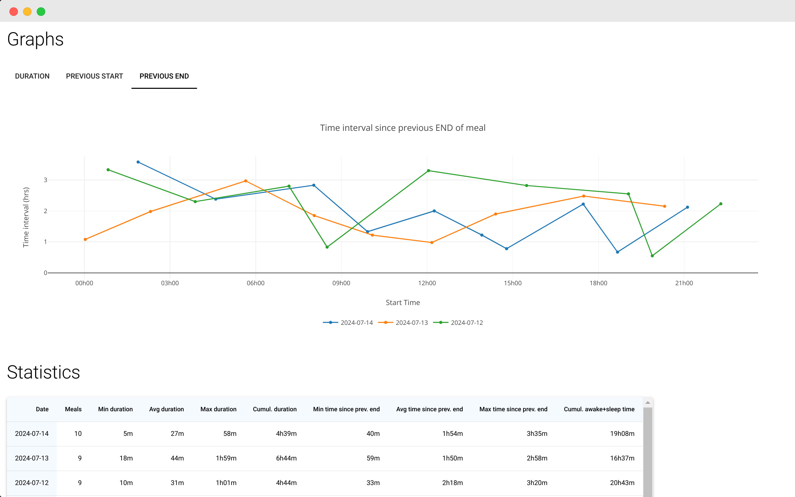

# Milk Tracker

  

<p float="left">
    
    
</p>

Basic breastfeeding data analysis and tracking

## Introduction

The idea of this app stemmed from the need to track and visualize breastfeeding meal statistics stored in a Pandas DataFrame. This was the opportunity to learn how to create and deploy a web app based on python-based nicegui, an alternative to streamlit with better state management and handling of user interaction. It quickly expanded to learn even more how to develop python applications with best development practices like:

- formatting and linting with [ruff](https://github.com/astral-sh/ruff)
- deploying with GitHub Actions
- split code using a model-view-controller design pattern
- validate data using [pydantic](https://github.com/pydantic/pydantic) models
- keep track of changes using [git-cliff](https://github.com/orhun/git-cliff)
- managing a python environment using [micromamba](https://mamba.readthedocs.io/en/latest/user_guide/micromamba.html)
- Testing the code prior to releasing using [pytest](https://pytest.org/)
- Calculating the coverage of tests using [coverage](https://coverage.readthedocs.io/en/latest/)
- Typing python code and checking it with [mypy](https://mypy.readthedocs.io/en/stable/)

Huge thanks to the Open Source community for providing such great tools to the world.

## Features

- Protect access with password
- Record meals start and end times
- Lock start time of new meal
- Keep track of meal rounds during ongoing meal
- Reminders for daily intake of vitamins
- See latest three days trends in graphs
- See daily stats in a table

## Backlog

- Keep a log of daily observations
- Edit and delete any meal
- Prediction of next meal's time and duration

## Self-hosting

The following instructions rely on the use of [micromamba](https://mamba.readthedocs.io/en/latest/user_guide/micromamba.html) for managing python environment and [nginx](https://nginx.org) for the web server. 

1. Use `env.yaml` file to create your environment: `micromamba env create -f env.yaml`
2. Copy `milk_tracker` folder in your web server area, e.g. `/var/www/`
3. Create an `.env` file within that folder with the following content: 

```
APP_PORT=<port_number>
PASSWORD=<argon2 password hash as login>
STORAGE_SECRET=<passphrase to protect your storage area>
```

4. Customize the `milk_tracker/config.yaml` file
5. Use `scripts/milk-tracker.conf` as example to configure the redirection of http requests to your app using nginx and your own domain
6. Use `scripts/milk-tracker.service` as example to configure a systemd unit to manage the start/stop of the app
7. Enable the unit, e.g. `systemctl --user enable milk-tracker.service` if you're running the app using a specific user and choose to run user units
8. Start the app, e.g. `systemctl --user start milk-tracker.service` 
9. Go to [https://<your_domain>:<port_number>](https://<your_domain>:<port_number>) and start tracking :-)

## License

MIT License

Copyright (c) 2024 Thomas Lamant